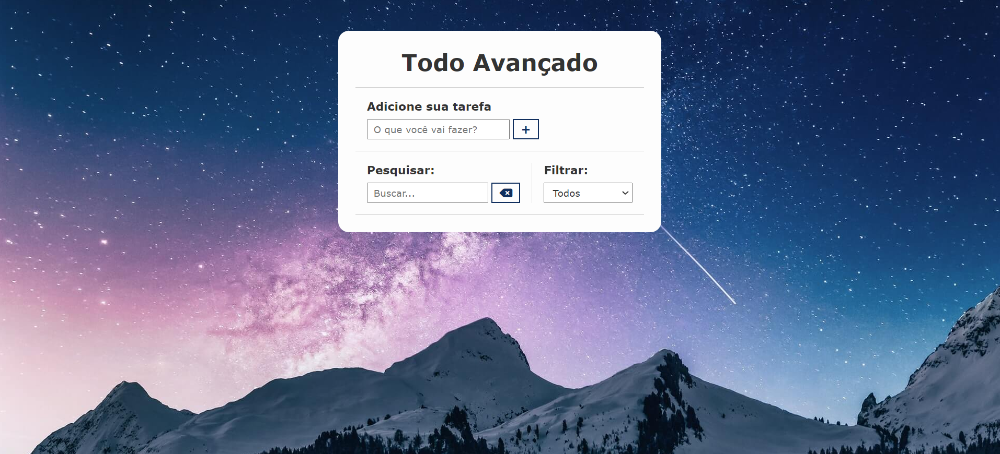

# To-Do List

Bem-vindo ao meu aplicativo de lista de tarefas, uma ferramenta simples e eficaz para organizar suas atividades diárias.

#

- Deploy Vercel ☁️:
  - [To_do_list](https://to-do-list-psi-eosin-49.vercel.app/) 🎬

#

<p align="center">
  
</p>

# Visão Geral

O aplicativo de lista de tarefas é uma solução prática para gerenciar suas tarefas diárias, garantindo que você permaneça produtivo e organizado. Com uma interface intuitiva, o aplicativo proporciona uma experiência fácil e rápida para adicionar, visualizar e gerenciar suas tarefas.

# Recursos Principais

Adicionar Tarefas: Adicione novas tarefas à sua lista de forma simples e rápida.

Marcar como Concluída: Marque as tarefas concluídas para fácil acompanhamento de progresso.

Excluir Tarefas: Remova tarefas que não são mais necessárias para manter sua lista organizada.

Priorização: Atribua prioridades às tarefas para focar nas mais importantes.

# Tecnologias Utilizadas

HTML5
CSS3
JavaScript
Como Usar
Clone o repositório:

## Como Usar

1. Clone o repositório:

   ```bash
   git clone git@github.com:brunobendel/to_do_list.git
   ```

Navegue até o diretório do projeto.
Abra o arquivo index.html em seu navegador.
Gerencie suas tarefas:

Adicione novas tarefas.
Marque as tarefas como concluídas.
Exclua tarefas desnecessárias.
Priorize suas tarefas para se manter focado.
